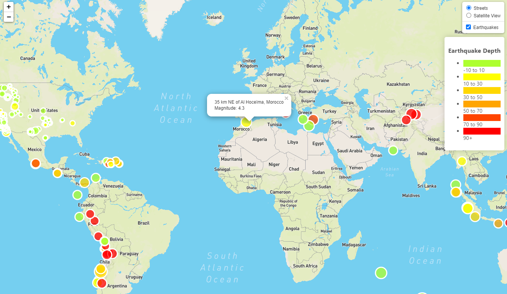

# USGS Earthquake Visualization
Use Leaflet to visualize USGS worldwide weekly earthquake data.

## Status
_finished_

## Acknowledgements
[USGS GeoJSON Weekly Feed](https://earthquake.usgs.gov/earthquakes/feed/v1.0/summary/all_week.geojson)

[Mapbox Satellite](https://api.mapbox.com/styles/v1/mapbox/satellite-streets-v11.html?title=true&access_token=pk.eyJ1IjoibWFwYm94IiwiYSI6ImNpejY4M29iazA2Z2gycXA4N2pmbDZmangifQ.-g_vE53SD2WrJ6tFX7QHmA#3.78/38.64/-95.72)

[Mapbox Streets](https://api.mapbox.com/styles/v1/mapbox/streets-v11.html?title=true&access_token=pk.eyJ1IjoibWFwYm94IiwiYSI6ImNpejY4M29iazA2Z2gycXA4N2pmbDZmangifQ.-g_vE53SD2WrJ6tFX7QHmA#1.07/0/0)

<!-- [Tectonic Plates Data](https://github.com/fraxen/tectonicplates) -->

## Inspiration
This project was assigned as part of the UTSA Data BootCamp.
